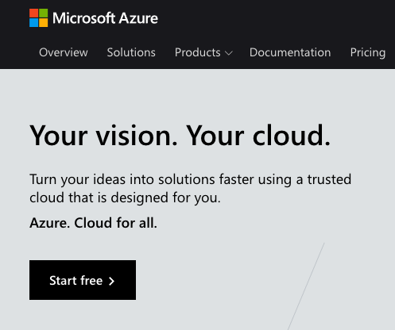

# Long form installation instructions

This guide assumes you have limited knowledge of the
Azure produts.

## Feedback requested!
If you have ideas on how these guides can be improved,
please open an Issue for this repository. Or submit a 
pull request. Thank you.

## Contents
1. Azure account (below)
1. [Create a Service Bus Namespace](docs/INSTALLATION_2_svc_bus_namespace.md)
1. [Create a Service Bus Namespace Connection String](docs/INSTALLATION_3_svc_bus_connection_string.md)
1. [Create a Service Bus Queue](docs/INSTALLATION_4_svc_bus_queue.md)
1. [Create the Azure Function](docs/INSTALLATION_5_function.md)

## 1. Azure account

1. [Create an account on Azure](https://azure.microsoft.com)

   
   
   Figure 1. Signup: click **Start free**

1. During your first month of use,
   you do not need to add billing information to your Azure
   account.

Next: Create a [Service Bus Namespace](docs/INSTALLATION_2_svc_bus_namespace.md)
