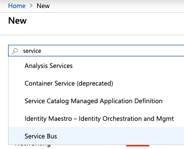

# Create a Service Bus Namespace

#### Summary
Use this article to create
an Azure Service Bus **Namespace**.

#### Steps 

1. Open the 
   [Azure Portal](https://portal.azure.com/#home)
   page.
1. In the left-hand navigation column,
   at the top, click **Create a resoure**.
1. Search for **service** and then
   select **Service Bus** 
   See figure 1, below.

   
   
   Figure 1. Search for, and then select **Service Bus**

1. The Service Bus product page will be shown.
   Click **Create**.

1. The **Create namespace** form is shown, see 
   figure 2. Fill in the form:

   1. Pricing tier: You can use **Basic**.
   1. Subscription: Use your initial **Free Plan** or
      one of your billing plans.
   1. Resource group: 
   
      **Recommended**: Click **Create new** to
      create a resource group that you will use to 
      group together all of your Connect Listener
      Azure services.

   
   
   Figure 2. Complete the **Create namespace** form and click **Create**
1. After the namespace has been created, you will 
   see it listed in your Azure Resource group.

Next: [Create a Shared access policy](INSTALLATION_3_svc_bus_connection_string.md)
and connection string for the namespace.
